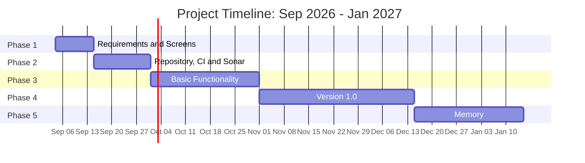

# HooutOut: A web application for Instant Messaging 
 

HootOut is a real-time messaging application.

Send direct messages to friends or join a Server to chat with multiple people. Organize your conversations in channels and send messages to other Server members.

**This is a work in progress. In this Phase 1, only functional and technical goals are defined. Implementation has not yet begun.**
 

## Goals:

Hooutout aims to be an instant messaging application where you can chat with direct messages, or join a server and chat with many people at the same time.

#### Functional Goals:

The goals of this project are that users can send messages to other users. They can send them via direct messages or in group chats called "Servers".
- Add other users as friends so you can send direct messages to them.
- Send emojis, gifs, images, videos, audio and files.
- Create or join a server and chat with multiple people at the same time.
- Organize server conversations by having different channels.
- Manage the server permissions by creating and assigning roles to members.
- Add third party applications to your servers to extend the functionality.

#### Technical goals:

The main technical challenge is the real time nature of the application. Serving messages to multiple clients, preventing synchronization issues, connecting and disconnecting clients, clients with unstable connections.

- Frontend SPA in Vue.js.
- Backend REST API and Websockets with ASP.NET Core.
- Message broker with RabbitMQ to handle real time traffic and horizontal scaling.
- Automated backend and frontend testing, and code analysis with Sonar.
- GitHub Flow for git versioning and GitHub Projects with a Kanvan board for project management.
- Workflow automations with CI through GitHub Actions.
- Docker and Docker compose for deployments.

## Approach

This project is designed as a two-parts project. The first one is the development of the Instant Messaging application, and the second part is the cloud deployment of the application, ensuring scalability, and continuous deployment.

This is the approach and planning of the first project:

- Phase 1: Definition of functionalities and Screens of the application (September 15)
- Phase 2: Repository, CI and Sonar configuration (October 1)
- Phase 3: Basic functionality with tests: Unit tests, Integration tests and End to End tests (November 1)
- Phase 4: Version 1.0 - Full functionality and Docker (December 15)
- Phase 5: Memory (January 15)

#### Grantt Diagram:

## Detailed Functionality:

#### Basic Functionality:

- Unregistered users will have access only to public facing pages, such as the Landing Page, Register and Login.
- Users can register with an email (unique), username (unique) and a password. They will be able to upload a profile picture after registration.
- Users will need to confirm their email address to activate their account.
- Users can send a friend request to another user by username.
- Two users that are friends can send direct messages between them.
- Users can create a group chat, called "Server. The Server will have a server name, a short description and a Server picture.
- The creator of the Server will be able to edit name, description and picture. They will be able to delete the Server.
- Users that join a Server, will be able to add users to a Server.
- Users inside a Server will be able to create, edit and delete channels inside a Server. A channel will only have a name.
- Users will be able to send messages inside a channel of a Server they are part of.
- All messages will have the username, the profile picture, the local time when the message was stored on the server and the message content.
- Messages can include text, pictures, GIFs, videos, audio files, and documents. The user will be able to download them.
- Messages composed of text, pictures, GIFs, videos or audio will be displayed on the applications. 
- Users will have a connection status. These statuses are connected or disconnected. Users will be able to see friend and Server members status.
- Messages sent on a Channel will be sent to all the Server members with status connected.
- When a disconnected user connects, it will receive the last messages of a Server. After that, the user will be able to fetch older messages in a paginated way.

### Intermediate Functionality: 
- Users will be able to upload custom Emojis and Stickers to a Server.
- Introduction of Rol and permissions on Servers.
- Users will be able to create Roles in a Server. A role will have a name and a list of permissions.
- There will be a fixed set of permissions for Servers and Channels. Examples are:
- Edit/delete a Server.
- Create, edit and delete a Channel
- Delete other User messages on the Server.
- Invite/kick Users from a Server.
- When creating a Server, the User will have the role "Server Admin" with all the permissions.
- When a user joins a Server, he will have a default Rol "member".
- A User can have multiple roles in a Server.

### Advanced Functionality: 
- Integration with "Bots" and Third-Party Applications.
- Authorization and Authentication of Bots will be made via tokens.
- A Bot will be able to join a Server as a member and will have the rol "Bot".
- Bots can have additional roles like any other member.
- Users will be able to send commands on a Server on the chat. Commands will start with "/". 
- Third Party Applications will be able to register commands to a Server.
- Public facing API for Bots, where it can 
- Bots will be able to send and receive messages in real time. (Either through websockets or some type of Endpoint Callback).

## Analysis:

### Screens and navigation

### Entities

## Project tracking:

Project tracking and task management will be done with a GitHub Project. A Kanban board will be used.

## Author:

This application is being developed as part of the double Bachelor's Degree for Computer Science and Software Engineering at the "Escuela Técnica Superior de Ingeniería Informática (ETSII) de la Universidad Rey Juan Carlos (URJC)"

This first version will be part of the Computer Science Degree Final Project. A future version will be developed for the Software Engineering Degree Final Project.

The author of this project is Iván Motos Montalbán, under the academic supervision of Michel Maes Bermejo, the Tutor of the Bachelor's Degree Thesis.

